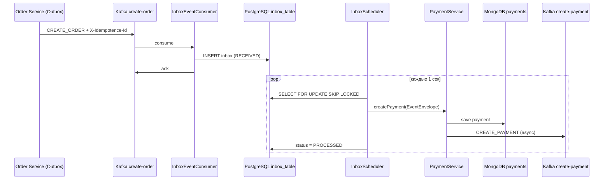
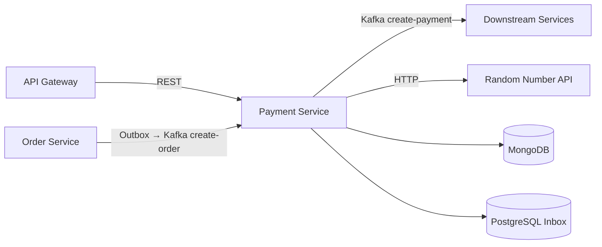

# Payment Service

Микросервис обработки платежей в распределённой системе. Сервис принимает события создания заказа из Kafka, надёжно сохраняет их через паттерн **Inbox**, создаёт платёж в MongoDB и публикует событие `CREATE_PAYMENT` для downstream-сервисов. Также предоставляет REST API для чтения и управления платежами.

---

## Содержание

- [Назначение](#назначение)
- [Архитектура](#архитектура)
- [Паттерны](#паттерны)
- [Технологический стек](#технологический-стек)
- [Потоки данных](#потоки-данных)
- [REST API](#rest-api)
- [Kafka](#kafka)
- [Inbox](#inbox)
- [Хранилища данных](#хранилища-данных)
- [Идемпотентность](#идемпотентность)
- [Метрики и мониторинг](#метрики-и-мониторинг)
- [Безопасность](#безопасность)
- [Профили и конфигурация](#профили-и-конфигурация)
- [Запуск](#запуск)
- [Тестирование](#тестирование)
- [Структура проекта](#структура-проекта)

---

## Назначение

Payment Service выполняет следующие задачи:

1. **Асинхронная обработка заказов** — подписка на топик `create-order` от Order Service (через Outbox).
2. **Создание платежа** — определение статуса `PAID` / `FAILED` на основе внешнего Random Number API.
3. **Публикация события** — отправка `CREATE_PAYMENT` в Kafka после успешного сохранения платежа.
4. **REST API** — CRUD-операции и аналитические запросы по платежам.
5. **Надёжная доставка** — Inbox гарантирует, что Kafka-сообщение не потеряется между получением и обработкой.

---

## Архитектура



Сервис использует **два хранилища**:

| Хранилище | Назначение |
|-----------|------------|
| **PostgreSQL** | Inbox-таблица (состояние входящих событий) |
| **MongoDB** | Документы платежей |

---

## Паттерны

| Паттерн | Где используется | Описание |
|---------|------------------|----------|
| **Transactional Inbox** | `InboxEventConsumer` + `InboxScheduler` | Двухфазная обработка: быстрый ack после записи в БД, асинхронная бизнес-логика |
| **Idempotent Consumer** | `inbox_table.idempotence_id` | `INSERT ON CONFLICT DO NOTHING` — дедупликация на уровне БД |
| **Event Envelope** | `EventEnvelope<T>` | Обёртка payload + `traceId` + `sourceService` для сквозной трассировки |
| **Profile-based impl** | `PaymentServiceImpl` / `PaymentServiceProdImpl` | Разные реализации для dev и prod (транзакции MongoDB в prod) |
| **Repository** | JPA + Spring Data MongoDB | Абстракция доступа к данным |
| **DTO Mapping** | MapStruct (`OrderEventMapper`, `PaymentResponseMapper`) | Преобразование между слоями |
| **Dead Letter** | `InboxEventStatus.DEAD` | События, исчерпавшие лимит retry, помечаются как DEAD с алертом |
| **Gateway Auth** | `GatewayAuthFilter` | JWT-аутентификация для запросов через API Gateway |

> **Outbox** на стороне producer реализован в Order Service. Payment Service использует **Inbox** на стороне consumer. Исходящие события `CREATE_PAYMENT` для сравнения подходов пока публикуются напрямую (без Outbox).

---

## Технологический стек

| Категория        | Технология |
|------------------|------------|
| Язык             | Java 21 |
| Framework        | Spring Boot 3.5.5 |
| Сообщения        | Apache Kafka (Spring Kafka) |
| SQL БД           | PostgreSQL 42.7 + Spring Data JPA |
| NoSQL БД         | MongoDB 6 + Spring Data MongoDB |
| Миграции         | Liquibase (PostgreSQL + MongoDB extension) |
| Маппинг          | MapStruct 1.6 |
| HTTP-клиент      | Spring WebFlux (WebClient) |
| Безопасность     | Spring Security + OAuth2 Resource Server |
| Документация API | SpringDoc OpenAPI 3 |
| Метрики          | Micrometer + Prometheus (Actuator) |
| Логирование      | Logback + Logstash JSON Encoder |
| UUID             | uuid-creator (time-ordered UUID v7) |
| Общие DTO        | `common-events` (GitHub Packages) |
| Общие библиотеки | `common-filters-spring-boot-starter` (GitHub Packages) |
| Контейнеризация  | Docker (multi-stage build) |
| Тесты            | JUnit 5, Mockito, Testcontainers, WireMock |

---

## Потоки данных

### Входящий поток (Kafka → Payment)

1. Order Service публикует `OrderEventDto` в топик `create-order` с заголовками:
   - `X-Idempotence-Id` — UUID события outbox
   - `X-Event-Type` — тип события
   - `X-Trace-Id` — идентификатор трассировки
   - `X-Source-Service` — имя сервиса-отправителя

2. `InboxEventConsumer` сериализует payload в JSON и сохраняет в `inbox_table` со статусом `RECEIVED`.

3. `InboxScheduler` (каждую 1 сек) выбирает пакет событий (`RECEIVED` / `FAILED`) с `FOR UPDATE SKIP LOCKED`.

4. `InboxServiceImpl` десериализует payload, вызывает `PaymentService.createPayment(EventEnvelope)`.

5. При успехе — статус `PROCESSED`. При ошибке — `retry_count++`, после 10 попыток — `DEAD`.

### Исходящий поток (Payment → Kafka)

1. `PaymentService` сохраняет `Payment` в MongoDB.
2. `PaymentEventProducer` отправляет `PaymentEventDto` в топик `create-payment` (асинхронно, fire-and-forget).
3. Заголовки: `X-Idempotence-Id`, `X-Event-Type`, `X-Trace-Id`, `X-Source-Service`.

### HTTP-поток

REST-запросы обрабатывает `PaymentController` → `PaymentService` → `PaymentRepository`.

---

## REST API

Базовый путь: `/api/payments`

| Метод | Путь | Описание |
|-------|------|----------|
| `GET` | `/{id}` | Получить платёж по ID |
| `PUT` | `/{id}` | Обновить платёж |
| `DELETE` | `/{id}` | Удалить платёж |
| `GET` | `/order/{orderId}` | Платежи по заказу |
| `GET` | `/user/{userId}` | Платежи по пользователю |
| `GET` | `/statuses?statuses=PAID,FAILED` | Платежи по статусам |
| `GET` | `/sum?start=...&end=...` | Сумма платежей за период |

> Создание платежей происходит только через Kafka Inbox.

**Swagger UI (агрегированный, через Gateway):** [http://localhost:8080/swagger-ui.html](http://localhost:8080/swagger-ui.html)

**Swagger UI (напрямую, paymentservice):** [http://localhost:8084/swagger-ui.html](http://localhost:8084/swagger-ui.html)

---

## Kafka

### Consumer

| Параметр | Значение |
|----------|----------|
| Топик | `create-order` |
| Group ID | `payment-service-group` |
| Ack mode | `manual_immediate` |
| Класс | `InboxEventConsumer` |

### Producer

| Параметр | Значение |
|----------|----------|
| Топик | `create-payment` |
| Idempotence | `enable.idempotence=true` |
| Acks | `all` |
| Класс | `PaymentEventProducer` |

---

## Inbox

### Таблица `inbox_table` (PostgreSQL)

| Колонка | Тип | Описание |
|---------|-----|----------|
| `id` | UUID (PK) | Идентификатор записи |
| `idempotence_id` | UUID (UNIQUE) | Ключ дедупликации (= outbox event id) |
| `event_type` | varchar | Тип события |
| `payload` | jsonb | Сериализованный `OrderEventDto` |
| `source_service` | varchar | Сервис-отправитель |
| `trace_id` | varchar | Trace ID |
| `status` | varchar | `RECEIVED`, `PROCESSED`, `FAILED`, `DEAD` |
| `retry_count` | int | Счётчик попыток обработки |
| `created_at` | timestamp | Время получения |
| `processed_at` | timestamp | Время обработки |

### Жизненный цикл статусов

```
RECEIVED → PROCESSED     (успех)
RECEIVED → FAILED        (ошибка, retry_count < 10)
FAILED   → PROCESSED     (успешный retry)
FAILED   → DEAD          (retry_count >= 10)
```

### Алертинг

При переходе в `DEAD` компонент `InboxDeadLetterAlert` пишет ERROR-лог с маркером `INBOX_DEAD_LETTER_ALERT` — его можно использовать для алертов в Grafana Loki / ELK.

---

## Хранилища данных

### MongoDB — коллекция `payments`

| Поле | Тип | Описание |
|------|-----|----------|
| `_id` | String | Идентификатор платежа |
| `order_id` | String | ID заказа (индекс) |
| `user_id` | String | ID пользователя |
| `status` | enum | `PAID` / `FAILED` |
| `timestamp` | LocalDateTime | Время создания |
| `payment_amount` | BigDecimal | Сумма |

Индексы: `order_id`, `user_id`, `status` (Liquibase MongoDB).

### PostgreSQL — `inbox_table`

Управляется Liquibase: `db/changelog/postgresql/v.1.0/`.

---

## Идемпотентность

| Уровень | Механизм |
|---------|----------|
| Inbox ingest | `ON CONFLICT (idempotence_id) DO NOTHING` |
| Payment creation | `findFirstByOrderId()` — возврат существующего платежа |
| Concurrent insert | `DuplicateKeyException` → возврат существующего |
| Kafka consumer | Manual ack после durable write в inbox |

---

## Метрики и мониторинг

Эндпоинт: `GET /actuator/prometheus`

| Метрика | Тип | Описание |
|---------|-----|----------|
| `inbox.events.pending{status}` | Gauge | Количество событий по статусу |
| `inbox.events.processed` | Counter | Успешно обработанные |
| `inbox.events.failed` | Counter | Ошибки с retry |
| `inbox.processing.duration` | Timer | Время обработки одного события |
| `inbox.dead.letters` | Counter | Переведённые в DEAD |

Дополнительно: `/actuator/health`, `/actuator/info`, `/actuator/metrics`.

---

## Безопасность

- **Spring Security** — все `/api/**` требуют аутентификации.
- **GatewayAuthFilter** — для запросов от API Gateway парсит JWT из заголовка `Authorization` и устанавливает `SecurityContext`.
- **Публичные эндпоинты** — `/actuator/**` (настраивается через `security.public.endpoints`).
- **Внутренние вызовы** — запросы без заголовка Gateway проходят без JWT (для service-to-service).

---

## Профили и конфигурация

| Профиль | Файл | Назначение |
|---------|------|------------|
| `dev` | `application-dev.properties` | Локальная разработка |
| `prod` | `application-prod.properties` | Production (Docker) |
| `test` | `application-test.properties` (test scope) | Unit-тесты, @WebMvcTest, @DataMongoTest |
| `testcontainer` | `application-testcontainer.properties` (test scope) | Integration-тесты с Testcontainers + @EmbeddedKafka |

### Реализации PaymentService

| Профиль | Класс | Особенности |
|---------|-------|-------------|
| `dev`, `default` | `PaymentServiceImpl` | Без MongoDB-транзакций |
| `prod` | `PaymentServiceProdImpl` | `@Transactional` для MongoDB (replica set) |

---

## Запуск

### Требования

- Java 21
- Maven 3.9+
- Docker (для Kafka, MongoDB, PostgreSQL)
- GitHub Packages token (для `common-events`, `common-filters-starter`)

### Локально (dev)

```bash
# Kafka
docker-compose -f docker-compose-kafka-only.yml up -d

# MongoDB + PostgreSQL — запустить локально или через docker-compose

# Сборка и запуск
mvn spring-boot:run -Dspring-boot.run.profiles=dev
```

### Docker

```bash
docker build \
  --build-arg GITHUB_TOKEN=<token> \
  --build-arg GITHUB_USERNAME=<username> \
  -t paymentservice .

docker run -p 8084:8084 paymentservice
```

Профиль `prod` активируется автоматически в Dockerfile.

---

## Тестирование

```bash
mvn test
```

> Для integration-тестов (`*IT.java`) с `@EmbeddedKafka` и Testcontainers требуется **Docker**. Без Docker классы с `@Testcontainers(disabledWithoutDocker = true)` пропускаются.

### Структура тестов

```
src/test/java/com/mymicroservice/paymentservice/
├── unit/                          # Быстрые изолированные тесты (Mockito)
│   ├── controller/
│   ├── kafka/
│   ├── mapper/
│   ├── scheduler/
│   └── service/
├── integration/                   # Интеграционные тесты
│   ├── controller/
│   ├── kafka/                     # @EmbeddedKafka + Testcontainers
│   ├── repository/
│   └── service/
├── configuration/                 # Базовые классы Testcontainers
└── util/                          # Генераторы тестовых данных
```

### Типы тестов

| Класс | Тип | Инфраструктура | Сценарии |
|-------|-----|----------------|----------|
| `PaymentServiceImplTest` | Unit | Mockito | CRUD, идемпотентность `createPayment` |
| `InboxServiceImplTest` | Unit | Mockito | dedup, PROCESSED, retry, DEAD, poison |
| `InboxEventConsumerTest` | Unit | Mockito | ack/nack, RECEIVED, poison → DEAD |
| `PaymentEventProducerTest` | Unit | Mockito | заголовки Kafka, вызов `KafkaTemplate`, ошибка send |
| `InboxSchedulerTest` | Unit | Mockito | делегирование в `InboxService` |
| `PaymentControllerUnitTest` | Web | @WebMvcTest + MockMvc | REST-эндпоинты |
| `*MapperTest` | Unit | MapStruct | маппинг DTO ↔ Entity |
| `PaymentRepositoryTest` | Data | @DataMongoTest + Testcontainers MongoDB | MongoDB-запросы |
| `InboxEventRepositoryTest` | Data | @DataJpaTest + Testcontainers PostgreSQL | inbox SQL, dedup, SKIP LOCKED |
| `PaymentServiceIT` | Integration | @EmbeddedKafka + MongoDB + WireMock | PaymentService + Kafka producer |
| `InboxEventConsumerIT` | Integration | @EmbeddedKafka + PostgreSQL + MongoDB | consumer → inbox RECEIVED, dedup |
| `PaymentEventProducerIT` | Integration | @EmbeddedKafka + PostgreSQL + MongoDB | producer → Kafka + заголовки |
| `InboxFlowIT` | Integration | @EmbeddedKafka + PG + Mongo + WireMock | полный flow, retry FAILED, DEAD после 10 попыток |
| `PaymentControllerTest` | Integration | @WebMvcTest + MockMvc | REST с мок-сервисом |
| `PaymentserviceApplicationTests` | Smoke | Testcontainers MongoDB | загрузка Spring-контекста |

### Kafka-тесты (`spring-kafka-test`)

Для классов, работающих с Kafka, используется **`@EmbeddedKafka`** (in-memory брокер) вместо внешнего Docker Kafka:

```java
@EmbeddedKafka(partitions = 1, topics = {CREATE_ORDER_TOPIC})
class InboxEventConsumerIT extends AbstractKafkaIntegrationTest { ... }
```

| Тест | Что проверяет |
|------|---------------|
| `InboxEventConsumerIT` | `InboxEventConsumer` сохраняет RECEIVED, игнорирует дубликат |
| `PaymentEventProducerIT` | `PaymentEventProducer` публикует в `create-payment` с `X-Idempotence-Id` |
| `InboxFlowIT` | Kafka → inbox → payment → Kafka; retry при невалидном payload; DEAD |
| `PaymentServiceIT` | `PaymentServiceImpl` отправляет `CREATE_PAYMENT` через producer |

Отправка тестовых сообщений с заголовками — через утилиту `KafkaTestMessageSender`.

### Генераторы тестовых данных

Все тестовые объекты создаются через утилиты в `src/test/java/.../util/`:

| Класс | Назначение |
|-------|------------|
| `PaymentEntitiesGenerator` | Список `Payment` |
| `OrderEventDtoGenerator` | `OrderEventDto` |
| `PaymentRequestDtoGenerator` | `PaymentRequestDto` |
| `PaymentEventDtoGenerator` | `PaymentEventDto` |
| `EventEnvelopeGenerator` | `EventEnvelope<OrderEventDto>` / `EventEnvelope<PaymentEventDto>` |
| `InboxEventGenerator` | `InboxEvent` (RECEIVED, FAILED) |
| `KafkaTestMessageSender` | отправка `OrderEventDto` в Kafka с idempotence-заголовками |
| `TestConstants` | общие константы (топики, UUID, traceId) |

### Стиль именования тестов

```
<имяМетода>_Should<Ожидание>_When<Условие>
```

Примеры:
- `createPayment_ShouldReturnExistingPayment_WhenOrderAlreadyHasPayment`
- `onCreateOrder_ShouldIgnoreDuplicate_WhenSameIdempotenceIdSentTwice`
- `processPendingInboxEvents_ShouldCreatePaymentAndPublishEvent_WhenInboxHasReceivedEvent`
- `onCreateOrder_ShouldSaveUnprocessableAndAck_WhenSerializationFails`

---

## Структура проекта

```
paymentservice/
├── src/main/java/.../paymentservice/
│   ├── controller/          # REST API
│   ├── kafka/
│   │   ├── inbox/           # InboxEventConsumer
│   │   └── PaymentEventProducer, EventEnvelope
│   ├── scheduler/           # InboxScheduler
│   ├── service/impl/        # PaymentServiceImpl, InboxServiceImpl
│   ├── repository/          # JPA + MongoDB
│   ├── metrics/             # InboxMetrics
│   └── configuration/       # Kafka, Liquibase, Security
├── src/main/resources/
│   ├── application.properties
│   ├── application-dev.properties
│   ├── application-prod.properties
│   └── db/changelog/        # PostgreSQL + MongoDB миграции
└── src/test/java/.../paymentservice/
    ├── unit/                  # Mockito, @WebMvcTest
    ├── integration/           # @EmbeddedKafka, Testcontainers
    ├── configuration/         # AbstractContainerTest, AbstractKafkaIntegrationTest
    └── util/                  # генераторы и KafkaTestMessageSender
```

---

## Интеграция с другими сервисами



| Сервис | Направление | Протокол | Контракт |
|--------|-------------|----------|----------|
| Order Service | → Payment Service | Kafka `create-order` | `OrderEventDto` + idempotence headers |
| Payment Service | → Downstream | Kafka `create-payment` | `PaymentEventDto` + trace headers |
| API Gateway | → Payment Service | REST `/api/payments/**` | JWT via Gateway |
| Random Number API | ← Payment Service | HTTP GET | `[42]` → PAID/FAILED |

---

## Лицензия

Учебный / демонстрационный проект @juliakaiko.
